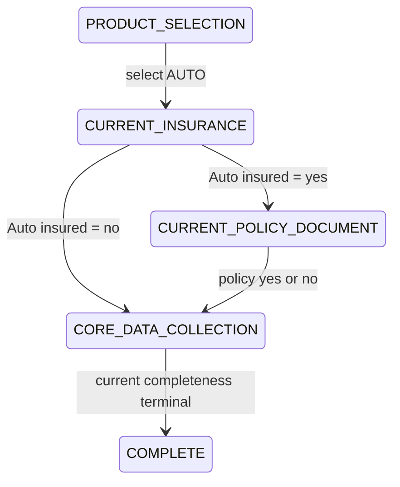
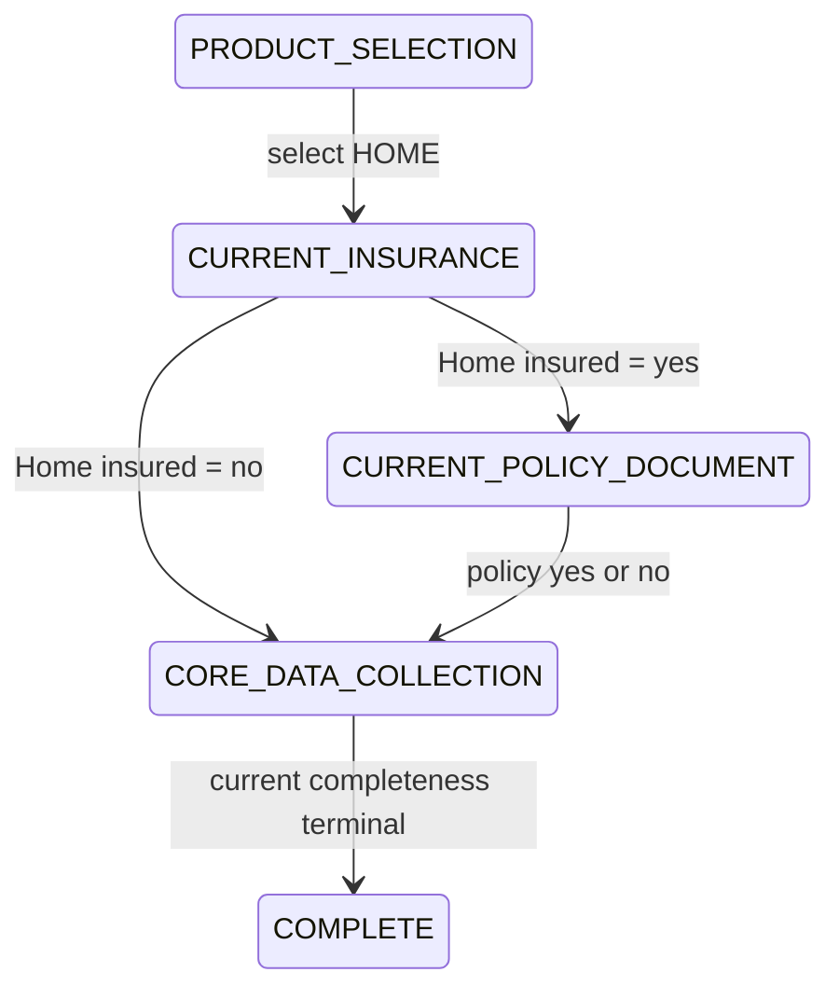

# R2 Intake State Machine

R2 restores the authoritative backend state machine for the customer intake
journey. The frontend renders `NextAction` payloads, but it does not decide the
journey phase or branch progression.

## Persisted model

`Lead` owns the intake aggregate state:

- `selectedProduct`: `AUTO`, `HOME`, or `AUTO_HOME`.
- `intakePhase`: `PRODUCT_SELECTION`, `CURRENT_INSURANCE`,
  `CURRENT_POLICY_DOCUMENT`, `CORE_DATA_COLLECTION`, or `COMPLETE`.
- `currentAutoInsured`: nullable boolean.
- `currentHomeInsured`: nullable boolean.
- `currentAutoPolicyAvailable`: nullable boolean.
- `currentHomePolicyAvailable`: nullable boolean.

Nullable booleans mean unknown when `null`. A policy availability field is only
blocking when the corresponding current-insurance field is `true`.

`CollectionAttempt` persists intake prompts with:

- `ASK_CURRENT_INSURANCE`
- `ASK_POLICY_DOCUMENT`

Each intake attempt stores `metadata.productDomain` as `AUTO` or `HOME`.

## Orchestration owner

`IntakeOrchestratorService` is the single owner of intake phase progression. It
persists product and intake answers, derives the next intake action, and enters
core collection only after all product-specific intake prerequisites are
resolved.

Core datapoint collection remains delegated to:

- `RequirementProfileService`
- `CompletenessResolver`
- `CollectionStrategyService`

## State invariants

- Product and phase are independent.
- `AUTO` requires only Auto insurance state.
- `HOME` requires only Home insurance state.
- `AUTO_HOME` requires Auto branch resolution and Home branch resolution.
- If a domain is not currently insured, policy availability for that domain is
  not blocking.
- Policy availability is persisted per domain.
- `COMPLETE` is persisted when the current collection strategy returns terminal
  completion.
- Subsequent authoritative requests after `COMPLETE` continue returning
  `COMPLETE`. Reopening on dossier changes is deferred.

## AUTO sequence

## HOME sequence

HOME policy OCR is not implemented in R2. A HOME policy availability answer is
persisted and intake continues deterministically to manual/core collection.

## AUTO_HOME sequence

```mermaid
stateDiagram-v2
  PRODUCT_SELECTION --> CURRENT_INSURANCE: select AUTO_HOME
  CURRENT_INSURANCE --> CURRENT_POLICY_DOCUMENT: Auto insured = yes
  CURRENT_POLICY_DOCUMENT --> CURRENT_INSURANCE: Auto policy answered
  CURRENT_INSURANCE --> CURRENT_INSURANCE: Auto insured = no; ask Home
  CURRENT_INSURANCE --> CURRENT_POLICY_DOCUMENT: Home insured = yes
  CURRENT_POLICY_DOCUMENT --> CORE_DATA_COLLECTION: Home policy answered
  CURRENT_INSURANCE --> CORE_DATA_COLLECTION: Home insured = no
  CORE_DATA_COLLECTION --> COMPLETE: current completeness terminal
```

The Home branch cannot be bypassed after the Auto branch. `AUTO_HOME` enters
`CORE_DATA_COLLECTION` only after both relevant branches are resolved.

## Policy behavior

R2 records whether a current policy is available, but does not restore
`CURRENT_AUTO_POLICY` OCR or add HOME policy OCR. If a policy is available, the
answer is persisted and the orchestrator continues to current deterministic core
collection behavior.

## Future Resume compatibility

R2 persists enough state for a future global Resume endpoint to determine:

- selected product
- current intake phase
- unresolved insurance domain
- unresolved policy availability domain
- whether core collection has started
- whether the journey is currently complete

The full Resume endpoint is deferred to R9.

## Deferred capabilities

R2 intentionally does not implement entity lifecycle, section confirmation,
policy OCR, vehicle registration OCR, collection loops, validation, risk, or
eligibility engines.
