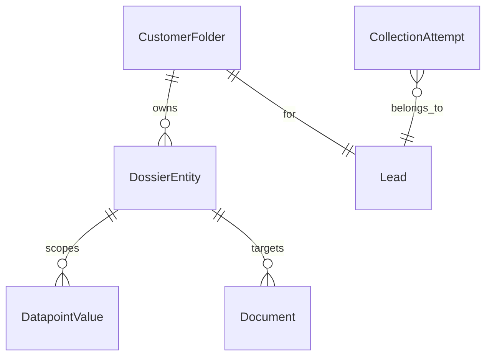

# R3 Primary Entity Lifecycle

R3 restores a single authoritative entity registry for customer dossiers. Business entity identity is now owned by the backend and persisted in `DossierEntity`; customer clients only receive entity IDs as opaque identifiers on actions and must not generate them.

## Persisted Model

`DossierEntity` fields:

- `id`: backend-generated UUID. Historical scoped UUIDs may be adopted when unambiguous.
- `customerFolderId`: ownership boundary for the customer dossier.
- `entityType`: `VEHICLE`, `DRIVER`, `PROPERTY`, `CLAIM`, or `CO_APPLICANT`.
- `role`: `PRIMARY`, `ADDITIONAL`, or `REPEATABLE`.
- `ordinal`: stable position within the role and type.
- `createdAt` / `updatedAt`: lifecycle timestamps.

## EntityRole And Ordinal

R3 actively orchestrates only `PRIMARY` entities. Primary entities always use `ordinal = 1`.

`ADDITIONAL` and `REPEATABLE` are present in the schema so R4 can add additional drivers, co-applicants, claims, and other repeatable records without changing the identity model. R3 does not create those records.

## Primary Uniqueness

The database enforces uniqueness on:

`customerFolderId + entityType + role + ordinal`

This permits exactly one primary vehicle, driver, and property per folder while leaving space for future additional or repeatable entities with distinct ordinals.

## Product To Primary Entity Map

- `AUTO`: primary `VEHICLE`, primary `DRIVER`
- `HOME`: primary `PROPERTY`
- `AUTO_HOME`: primary `VEHICLE`, primary `DRIVER`, primary `PROPERTY`

Entities are created lazily when core collection first needs scoped requirements. Lead creation does not create future or irrelevant entities.

## EntityLifecycleService

`EntityLifecycleService` is the only service responsible for primary entity lifecycle and ownership checks.

Supported operations:

- `ensurePrimaryEntity(leadId, entityType)`
- `getPrimaryEntity(leadId, entityType)`
- `assertOwnedEntity(leadId, entityId)`
- `assertOwnedEntityType(leadId, entityId, expectedType)`
- `listEntitiesForLead(leadId)`

`ensurePrimaryEntity` is idempotent and folder-scoped. Repeated calls for the same lead and primary type return the same entity. Ownership is validated through `CustomerFolder`, not UUID shape.

## Historical ID Adoption

Local development data can contain older `DatapointValue.entityId` values without matching `DossierEntity` records. When a folder has exactly one historical scoped ID for the requested primary type, R3 can adopt that UUID as the primary entity ID and emit `PRIMARY_ENTITY_ADOPTED`.

If multiple historical IDs exist for the same type, R3 does not guess. It creates the canonical primary entity through the normal lifecycle path and leaves historical values intact for provenance.

## Manual Collection Integration

`CollectionStrategyService` and `CompletenessResolver` resolve scoped primary requirements against canonical `DossierEntity` IDs. Successive primary vehicle, driver, and property questions reuse the same canonical ID.

Manual datapoint writes validate:

- the lead/session owns the request;
- scoped values include a real entity;
- the entity belongs to the lead's `CustomerFolder`;
- the entity type matches the datapoint definition;
- the datapoint is part of the selected product's active requirement profile.

Root/customer-scoped values continue to use existing root semantics and do not require a synthetic customer entity.

## Intelligence Normalization

Provider output is not authoritative for entity identity. Candidates for primary `VEHICLE`, `DRIVER`, or `PROPERTY` datapoints are normalized to the backend-owned primary entity ID for the selected product before candidate upsert.

Provider-generated IDs, missing IDs, or stale IDs cannot create business entities. Product-domain filtering still uses the persisted selected product and `RequirementProfileService`.

## DRIVER_LICENSE Integration

`DRIVER_LICENSE` document upload and processing now target the canonical primary `DRIVER` entity:

- If upload provides no entity ID, the backend ensures the primary driver.
- If upload provides an entity ID, it must be an owned `DRIVER` entity.
- Extracted driver datapoints are written against the same canonical driver entity.

R3 does not reconstruct additional document automation beyond existing driver-license behavior.

## Future Compatibility

R3 establishes the entity identity foundation for R4 repeatable entity lifecycle. Later milestones can add claim loops, additional drivers, co-applicants, section confirmation, resume, merge, validation, risk, and eligibility using the same `CustomerFolder -> DossierEntity -> scoped value/document` ownership model.

Deferred in R3:

- repeatable `CLAIM` lifecycle;
- `CO_APPLICANT` lifecycle;
- additional driver or vehicle lifecycle;
- `ASK_ADD_ANOTHER_ENTITY`;
- section review or reconfirmation;
- current auto policy reconstruction;
- home policy OCR;
- vehicle registration OCR;
- global resume endpoint.
