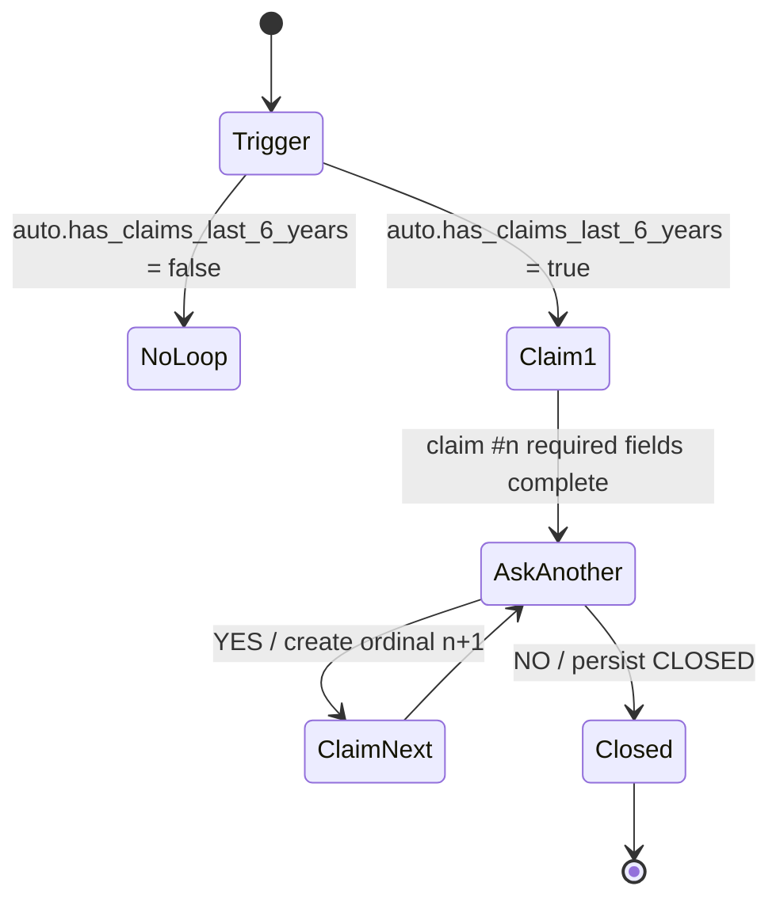
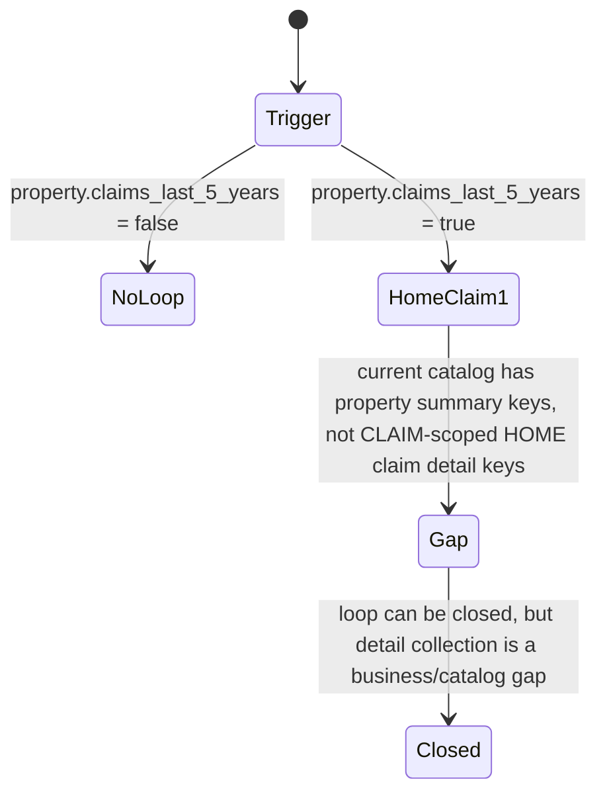
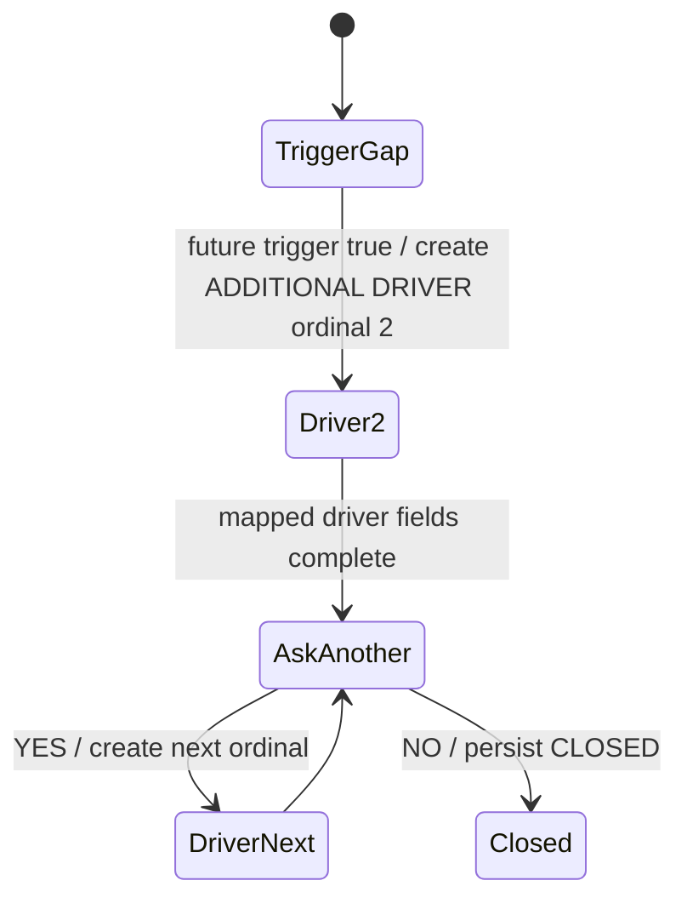

# R4 Repeatable Entity Lifecycle

R4 adds persisted loop state for repeatable collection. The backend remains the authority for entity existence, ordinals, loop status, and whether add-another decisions are pending.

## Schema

`DossierEntity` now includes `domain`:

- `NONE`: primary vehicle, driver, property, and non-domain entities.
- `AUTO`: auto claims and auto additional drivers.
- `HOME`: home claims and home co-applicant.

`CollectionLoop` persists repeatable sequence state:

- `customerFolderId`
- `entityType`
- `role`
- `domain`
- `status`
- `currentOrdinal`
- `triggerKey`
- `createdByAttemptId` / `closedByAttemptId`
- timestamps and `closedAt`

Loop statuses are `COLLECTING` and `CLOSED`.

## Invariants

- Primary entities use role `PRIMARY`, domain `NONE`, ordinal `1`.
- Additional drivers use entity type `DRIVER`, role `ADDITIONAL`, domain `AUTO`, ordinals starting at `2`.
- Claims use entity type `CLAIM`, role `REPEATABLE`, domain `AUTO` or `HOME`, ordinals starting at `1` within each domain.
- Co-applicant uses entity type `CO_APPLICANT`, role `ADDITIONAL`, domain `HOME`, ordinal `1`, and is a singleton.
- Entity IDs are always backend generated or safely adopted from historical data.

## ASK_ADD_ANOTHER_ENTITY

The shared `NextAction` model includes one generic add-another action:

```json
{
  "type": "ASK_ADD_ANOTHER_ENTITY",
  "entityType": "CLAIM",
  "domain": "AUTO",
  "loopId": "...",
  "ordinal": 1,
  "question": "Do you want to add another claim?",
  "input": { "type": "YES_NO" }
}
```

The frontend renders this as the same canonical Yes/No control used for intake yes/no actions. It never creates entity IDs or ordinals.

## AUTO Claim Loop



AUTO claims use existing catalog keys:

- `claim.type`
- `claim.year`
- `claim.description`

## HOME Claim Loop



The current 132-definition catalog does not contain HOME `CLAIM`-scoped detail definitions. R4 persists HOME claim loop/domain state but does not invent duplicate catalog keys.

## Additional Driver Loop



Mapped existing driver keys for additional drivers:

- `driver.first_name`
- `driver.last_name`
- `driver.date_of_birth`
- `driver.relationship_to_proposer`
- `driver.occupation`
- `driver.license_type`
- `driver.driving_start_year_quebec`

The current catalog has no `auto.additional_driver_exists` trigger. R4 exposes deterministic backend loop support but reports the missing trigger as a business gap.

## Co-applicant

When `property.has_co_applicant = true`, R4 ensures exactly one HOME `CO_APPLICANT` entity and evaluates supported conditional fields against it:

- `co_applicant.first_name`
- `co_applicant.last_name`
- `co_applicant.date_of_birth`

Optional current fields remain optional:

- `co_applicant.email`
- `co_applicant.relationship`

## Ownership And Idempotency

All scoped writes validate that the entity belongs to the lead's `CustomerFolder`, matches the datapoint entity type, and is role/domain-compatible with the definition. Claim domain mismatches are rejected.

Loop YES/NO answers are tied to `CollectionAttempt` IDs. Replaying an already completed add-another action is a safe no-op and cannot create duplicate entities or reopen a closed loop.

## Completeness Integration

Completeness now accepts multiple canonical entity IDs per entity type. It evaluates each active repeatable entity independently, so Claim #1 values cannot satisfy Claim #2. Open loops are checked before COMPLETE; when a loop is open and its current entity is complete, NOVA returns `ASK_ADD_ANOTHER_ENTITY` instead of `COMPLETE`.

R5 can later extend completion with section review and explicit confirmation without rewriting the loop model. R9 can use persisted loops to resume at the current entity, add-another prompt, or closed state.
