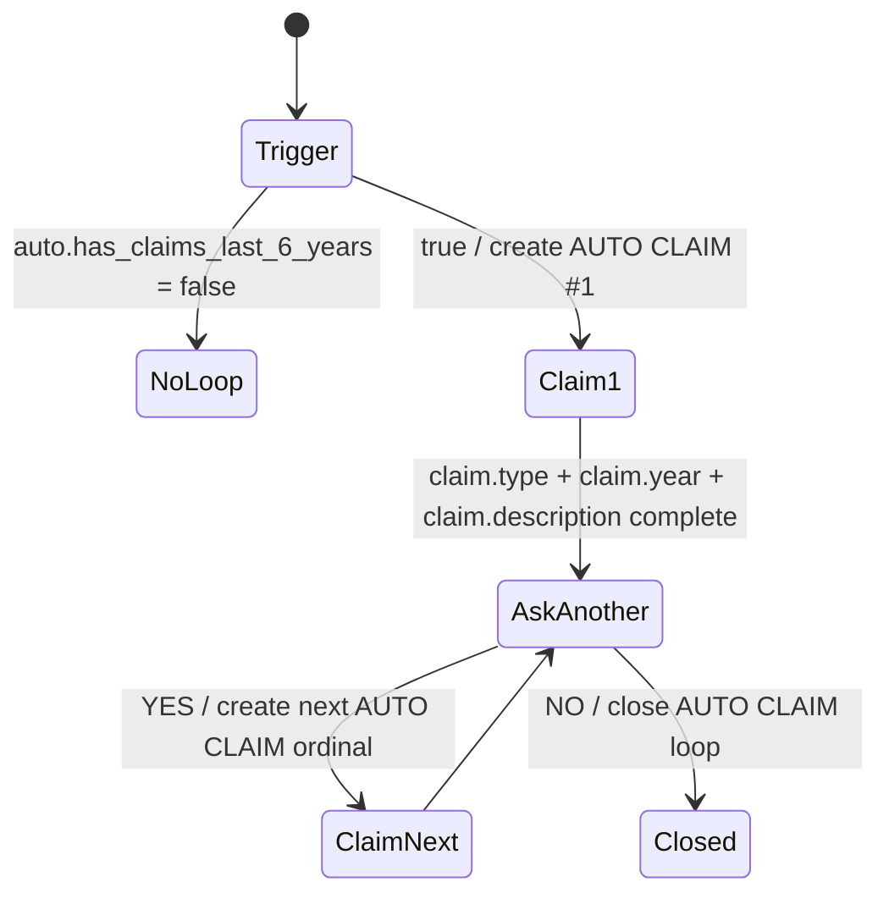
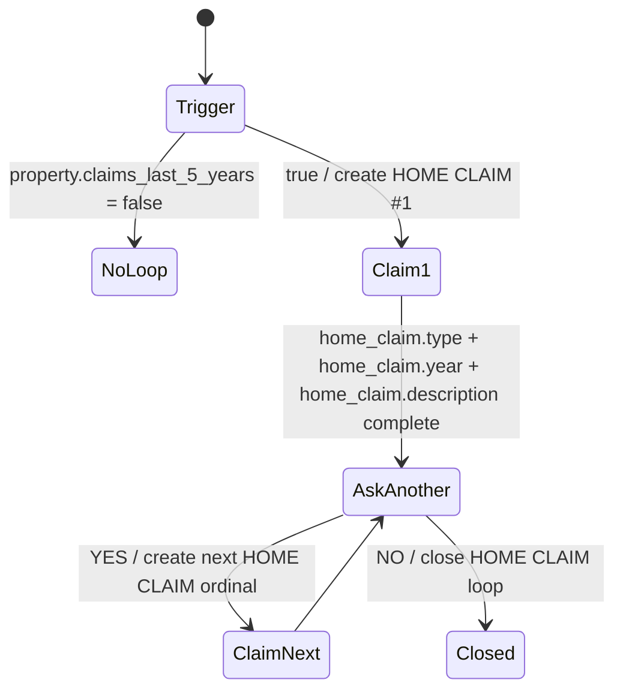
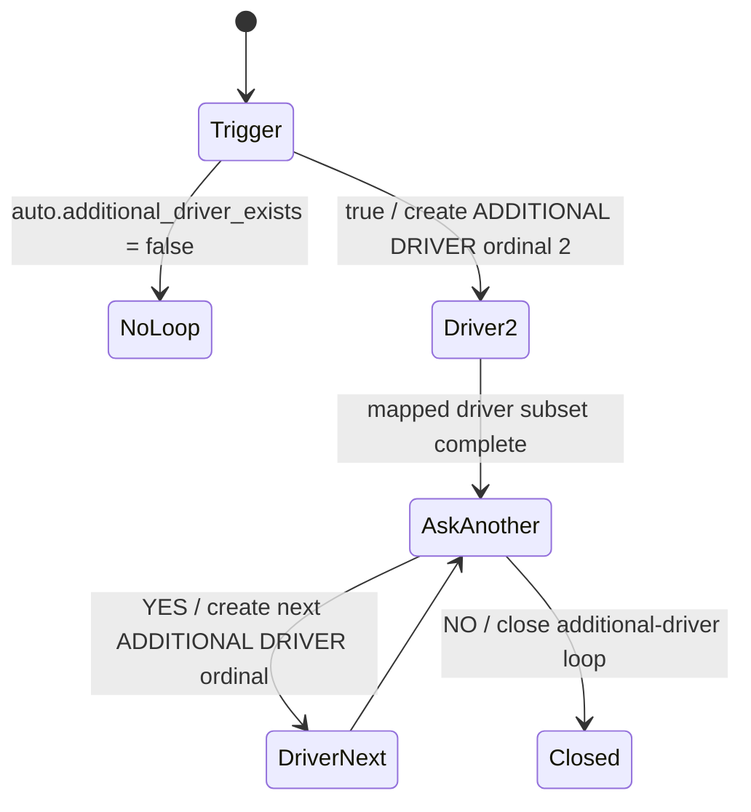

# R4.1 Repeatable Entity Lifecycle

R4.1 closes the repeatable collection gaps left by R4. The backend remains authoritative for repeatable entity existence, ordinals, loop status, and add-another closure.

## Persisted Model

`DossierEntity.domain` separates repeatable domains:

- `AUTO` for AUTO claims and additional drivers.
- `HOME` for HOME claims and co-applicant.
- `NONE` for primary entities.

`CollectionLoop` persists:

- `customerFolderId`
- `entityType`
- `role`
- `domain`
- `status`: `COLLECTING` or `CLOSED`
- `currentOrdinal`
- trigger context and timestamps

## Catalog Reconciliation

Before R4.1:

- HOME claim trigger existed as `property.claims_last_5_years`.
- HOME claim detail was property-scoped summary data, so Claim #2 could not be represented.
- AUTO additional-driver trigger was missing.
- Co-applicant profession, relationship-as-required, civility, and co-applicant-as-driver were missing or non-blocking.

After R4.1:

- AUTO count is 48.
- HOME count is 71.
- Total catalog count is 139.
- HOME repeatable claim details are `CLAIM` scoped via `home_claim.*`.
- Property claim summary keys remain optional and non-blocking.

## AUTO Claims

AUTO claim keys:

- `claim.type`
- `claim.year`
- `claim.description`

## HOME Claims

HOME claim keys:

- `home_claim.type`
- `home_claim.year`
- `home_claim.description`

Completeness is domain-aware. AUTO claim entities do not satisfy HOME claim requirements and HOME claim entities do not satisfy AUTO claim requirements.

## Additional Drivers

Additional-driver required keys:

- `driver.first_name`
- `driver.last_name`
- `driver.date_of_birth`
- `driver.relationship_to_proposer`
- `driver.occupation`
- `driver.license_type`
- `driver.driving_start_year_quebec`

Primary-driver values do not satisfy additional-driver required values.

## Co-applicant

When `property.has_co_applicant = true`, exactly one HOME `CO_APPLICANT` entity is created. Required keys:

- `co_applicant.civility`
- `co_applicant.first_name`
- `co_applicant.last_name`
- `co_applicant.date_of_birth`
- `co_applicant.occupation`
- `co_applicant.relationship`
- `co_applicant.is_vehicle_driver`

`co_applicant.is_vehicle_driver` captures the fact only. R4.1 does not create or link an AUTO driver from the co-applicant.

## Completion Safety

NOVA must not return `COMPLETE` while:

- a required loop is `COLLECTING`;
- a positive trigger has not created its required entity;
- a current repeatable entity is incomplete;
- Claim #2/Claim #3 is missing fields that Claim #1 already has.

## Future Integration

R5 can add section review and explicit confirmation on top of these loop closure semantics. R9 Global Resume can use `CollectionLoop.status`, `currentOrdinal`, and `DossierEntity` ordinals to resume at the current repeatable entity or add-another prompt.
