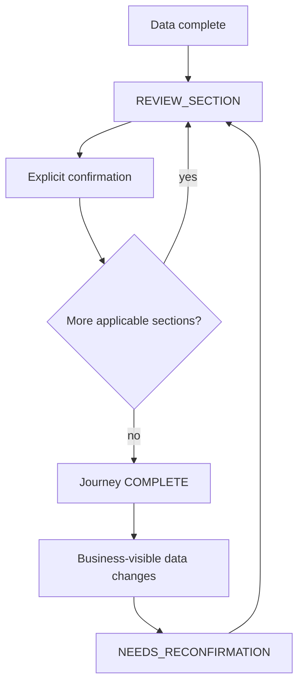

# R5 Section Review and Confirmation

R5 separates data completeness from journey completeness.

Data complete means the selected product profile has no unresolved required or
triggered blockers and every required repeatable `CollectionLoop` is closed.
Journey complete means data complete plus every applicable review section is
explicitly confirmed by the customer.

## Persisted Model

`SectionConfirmation` is scoped to `CustomerFolder`, selected `Product`, and
`sectionCode`.

Statuses:

- `COLLECTING`
- `READY_FOR_REVIEW`
- `CONFIRMED`
- `NEEDS_RECONFIRMATION`

There is one current row per folder/product/section. Opening a review action
does not create duplicate confirmation state.

## Section Registry

Backend order is deterministic:

1. `PERSONAL`
2. `CONTACT_ADDRESS`
3. `REQUEST_CONSENTS`
4. `AUTO_CURRENT_INSURANCE`
5. `AUTO_VEHICLE_IDENTIFICATION`
6. `AUTO_ACQUISITION`
7. `AUTO_USE_PROTECTION`
8. `AUTO_DRIVER`
9. `AUTO_CLAIMS`
10. `HOME_CURRENT_INSURANCE`
11. `HOME_PROPERTY_BASICS`
12. `HOME_BUILDING_SYSTEMS`
13. `HOME_SAFETY_LIFESTYLE`
14. `HOME_CLAIMS`
15. `HOME_CO_APPLICANT`
16. `HOME_DECLARATIONS`

Assignment counts for the R4.1 catalog:

- definitions assigned exactly once: 139
- unassigned definitions: 0
- duplicate assignments: 0

AUTO uses COMMON + AUTO sections. HOME uses COMMON + HOME sections. AUTO_HOME
uses COMMON once, then AUTO sections, then HOME sections.

## Review Action

When raw data is complete, the collection strategy asks the review service for
the next unconfirmed applicable section. The returned `REVIEW_SECTION` action
contains grouped display items, a `confirmationId`, and a deterministic
`snapshotHash`.

The frontend renders grouped values using labels such as Vehicle, Primary
driver, Additional driver 1, Auto claim 1, Home claim 1, Property, and
Co-applicant. Entity UUIDs are not shown.

## Snapshot Hash

The hash includes only business-visible state:

- item kind
- datapoint key or intake fact key
- canonical value
- entity type
- entity domain
- entity role
- entity ordinal

It deliberately excludes provenance rows, source metadata, confidence,
timestamps, and status metadata. A new source with the same visible value does
not invalidate confirmation. A changed value or changed repeatable entity
structure does.

## Confirmation And Reconfirmation

Confirmation is explicit. The customer must submit the current `snapshotHash`.
If the submitted hash is stale, the API rejects the confirmation.

If a confirmed section is rebuilt and its current hash differs from the stored
hash, the row becomes `NEEDS_RECONFIRMATION`. A journey that was COMPLETE under
pre-R5 semantics but has no confirmed sections is reopened for review; NOVA does
not fabricate historical customer confirmations.

## Edit Behavior

Review edits use the existing datapoint write boundary:

- anonymous session ownership
- selected product profile validation
- entity ownership
- entity type and domain validation
- catalog allowed values
- provenance preservation

After an edit, the frontend refreshes the authoritative current action from the
backend. It never marks a section confirmed optimistically.

## Repeatable Review

Repeatable entities remain distinct in review:

- AUTO claims are grouped by AUTO claim ordinal.
- HOME claims are grouped by HOME claim ordinal.
- Additional drivers are grouped by additional-driver ordinal.
- Co-applicant fields are grouped under a singleton co-applicant entity.

Adding a new repeatable entity after section confirmation changes the relevant
section snapshot and requires reconfirmation.

## Known Gap

The business source includes claims that belong to an additional driver. The
current entity model still has no explicit `CLAIM belongs to DRIVER` relation.
R5 does not pretend this relationship is implemented and does not review that
unrepresented sub-branch as complete business truth.

